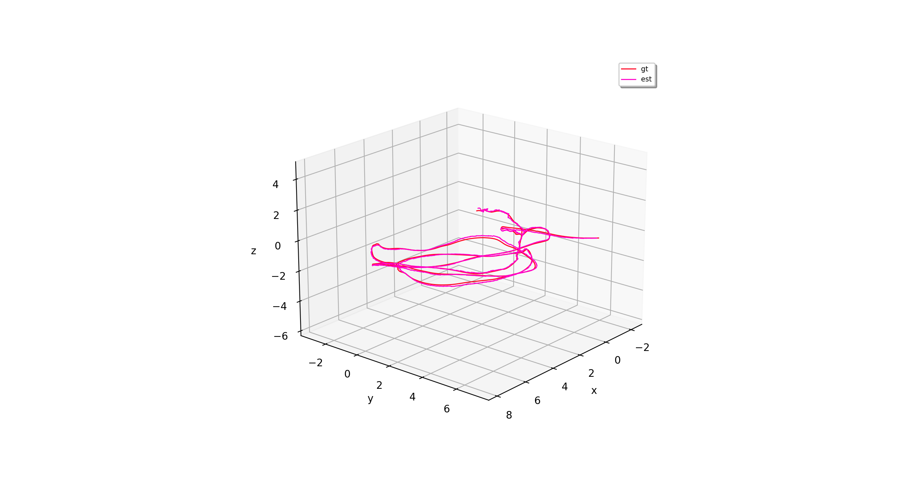

# The "trajectory" Package

A [Trajectory](Trajectory.py) object consists of a matrix of positions, orientations (Quaternions) and associated timestamps.
The object can be created by passing the these three matrices or by passing a `Pandas` `DataFrame` object containing them. 
The `DataFrame` will be converted using the class `TUMCSV2DataFrame`.

A trajectory object offers some conversions, load/store methods, plot, spatial transformations, etc.  

A `TrajectoryEstimated` is a specialization of a `Trajectory`, holding a covariances of the position and orientation to the timestamps, which can be loaded form a `DataFrame` too.

The `TrajectoryPlotter` offers methods to visualize a (or multiple) `Trajectory` objects.

## Dependencies

* [numpy]()
* [matplotlib]()
* [pandas]()
* [scipy]()
* [numpy_utils]()
* [trajectory]()
* [csv2dataframe]()
* [ros_csv_formats]()
* [matplotlib.pyplot]()

## Examples

Please refer to the unit-tests `Trajectory_Test` and `TrajectoryEstimated_Test` in `Trajectory/TrajectoryEstimated.py`.
For plotting options to the unit-test `TrajectoryPlotter_Test`.

### Pose plot

### Pose plot 3D

### Mutli pose plot 3D

## License

Software License Agreement (GNU GPLv3  License), refer to the LICENSE file.

*Sharing is caring!* - [Roland Jung](https://github.com/jungr-ait)  
