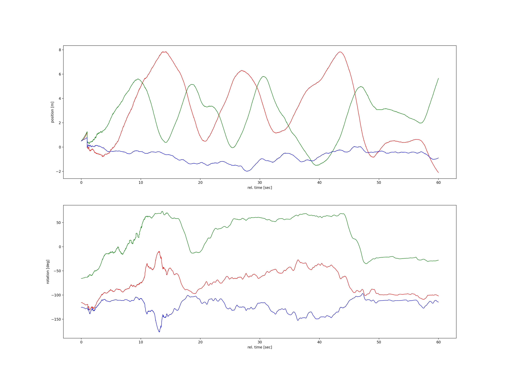

# The cnspy_trajectory Package

A [Trajectory](./cnspy_trajectory/Trajectory.py) object consists of a matrix of positions, orientations (Quaternions) and associated timestamps.
The object can be created by passing the these three matrices or by passing a `Pandas` `DataFrame` object containing them. 
The `DataFrame` will be converted using the class `TUMCSV2DataFrame`.

A trajectory object offers some conversions, load/store methods, plot, spatial transformations, etc.  

A `TrajectoryEstimated` is a specialization of a `Trajectory`, holding a covariances of the position and orientation to the timestamps, which can be loaded form a `DataFrame` too.

The `TrajectoryPlotter` offers methods to visualize a (or multiple) `Trajectory` objects.


## Installation

Install the current code base from GitHub and pip install a link to that cloned copy
```
git clone https://github.com/aau-cns/cnspy_trajectory.git
cd cnspy_trajectory
pip install -e .
```
or the [official package](https://pypi.org/project/cnspy-trajectory/) via
```commandline
pip install cnspy-trajectory
```


## Dependencies

It is part of the [cnspy eco-system](hhttps://github.com/aau-cns/cnspy_eco_system_test) of the [cns-github](https://github.com/aau-cns) group.  

* [numpy]()
* [matplotlib]()
* [pandas]()
* [scipy]()
* [cnspy_numpy_utils](https://github.com/aau-cns/cnspy_numpy_utils)
* [cnspy_csv2dataframe](https://github.com/aau-cns/cnspy_csv2dataframe)
* [cnspy_spatial_csv_formats](https://github.com/aau-cns/cnspy_spatial_csv_formats)
* [cnspy_trajectory](https://github.com/aau-cns/cnspy_trajectory)  
* [matplotlib.pyplot]()

## [PlotTrajectory](./PlotTrajectory.py)

```commandline
trajectory$ python PlotTrajectory.py -h
usage: PlotTrajectory.py [-h] [--filename FILENAME] [--result_dir RESULT_DIR] [--verbose] [--plot_3D] [--plot_pose] [--show_plots] [--save_metrics]

PlotTrajectory: tool to save plots and metrics of a trajectory

optional arguments:
  -h, --help            show this help message and exit
  --filename FILENAME   csv filename
  --result_dir RESULT_DIR
                        directory to store results]
  --verbose
  --plot_3D
  --plot_pose
  --show_plots
  --save_metrics
```

## Examples

Please refer to the unit-tests `Trajectory_Test` and `TrajectoryEstimated_Test` in `Trajectory/TrajectoryEstimated.py`.
For plotting options to the unit-test `TrajectoryPlotter_Test`.

### Pose plot


### Pose plot 3D


### Mutli pose plot 3D


## License

Software License Agreement (GNU GPLv3  License), refer to the LICENSE file.

*Sharing is caring!* - [Roland Jung](https://github.com/jungr-ait)  
